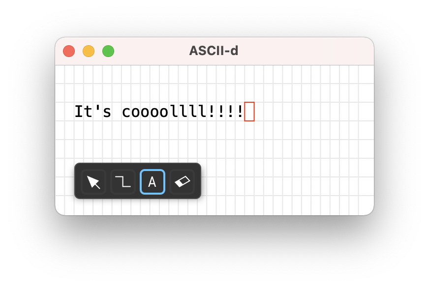
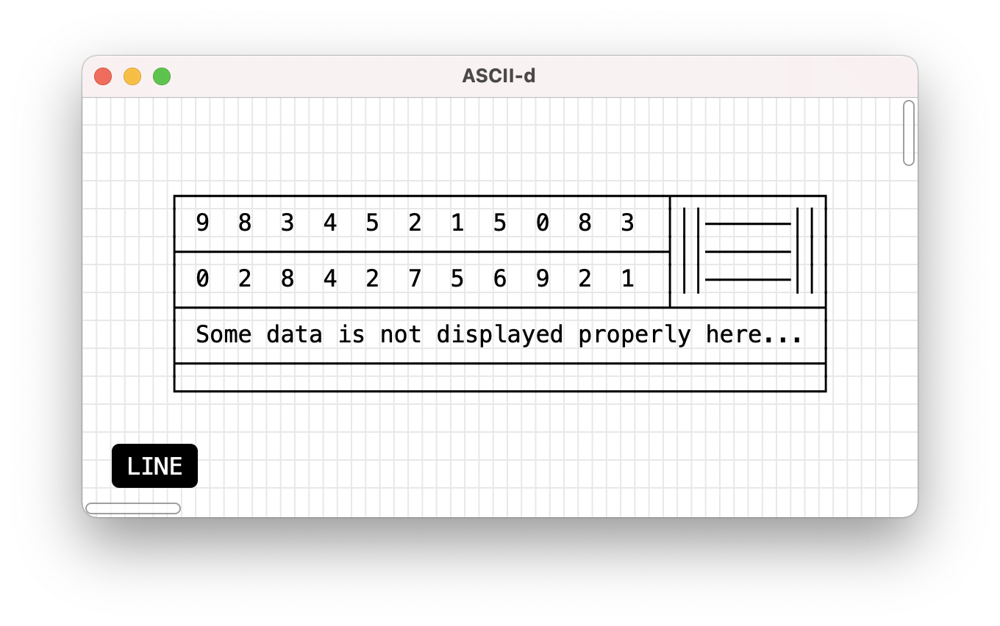
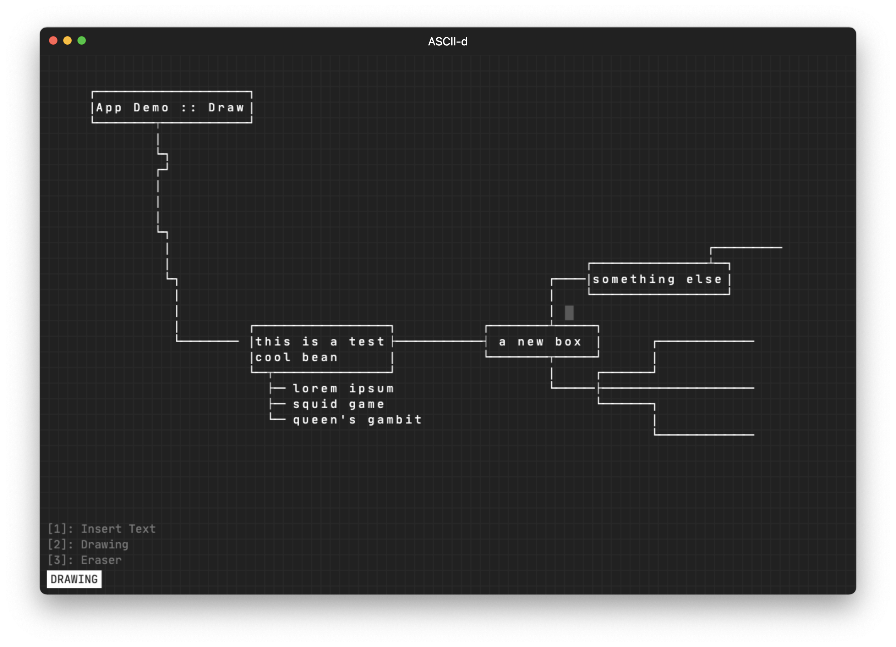
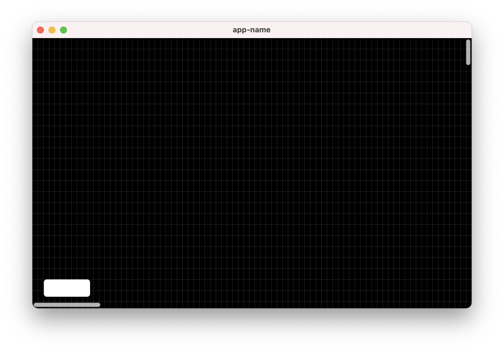
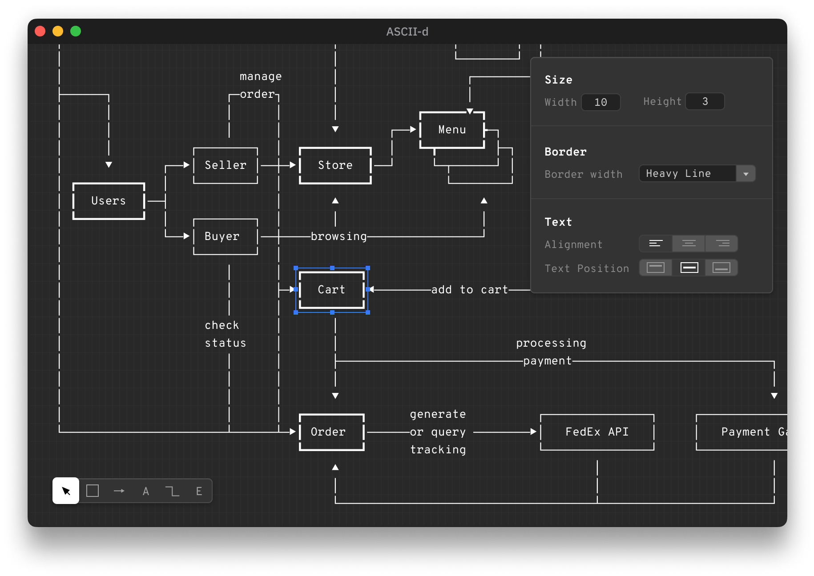

# Development Log

## Dec 14, 2021

It turned out Druid didn't have built-in support for Image inside a Button, lol, so I need to build a custom `ImageButton` widget. Most of the implementations are copied from the built-in Button widget.



Each `ImageButton` is created with a tag. Every time we click a button, we send a `Notification` from that button, with its tag to the parent widget. We pass down the `Command` with that tag to all the `ImageButton` from the parent widget. If an `ImageButton` finds the matching Command with its tag, it will be highlighted.

```
   ┌─────────────────┐
   │ toolbar widget  │
   └─────────────────┘
       ▲
       │ Notification(BUTTON_HIGHLIGHT)
       ├────────┬──────────┐
       │        │          │
   ┌───┴──┐  ┌──┴───┐  ┌───┴──┐
   │btn_1 │  │btn_1 │  │btn_1 │
   └──────┘  └──────┘  └──────┘

   ┌─────────────────┐
   │ toolbar widget  │
   └───┬─────────────┘
       │
       │ Command(BUTTON_HIGHLIGHT)
       ├────────┬──────────┐
       │        │          │
       ▼       ▼         ▼
   ┌──────┐  ┌──────┐  ┌──────┐
   │btn_1 │  │btn_1 │  │btn_1 │
   └──────┘  └──────┘  └──────┘
```

Honestly, I still don't like how tags are treated as `ImageButton` main property. That's something to be refactored later.

## Dec 11, 2021

Well, it almost took me a month to finish the text edit function. I had to make many underlying changes like rewriting `GridList` and `ShapeList` types to manage the interaction between `Tool` `Shape` and the actual list. More on this in [DEVELOPMENT.md](DEVELOPMENT.md).



Getting back to this project after a month-long break, at first, it seemed like I'd run out of motivation to keep working on ASCII-d, but it looks like that's because of the messy code I left over before the break. After a few days to clean them up, solve most of the remaining text editing issues. Now I'm back on track.

I decided to change the UI from dark theme to light. Now that the basic functionalities are ready, it's time to focus more on the UI. The next update will be about the toolbar.

## Oct 21, 2021

Before the current version, I’ve been trying to prototype ASCII-d using different languages/tech stack, one of them is the obvious choice: Electron. Just to get a glimpse of how my idea looks in action.



React and Electron is a great option to start a quick prototype, but long term wise, I don’t want to ship a 100 MB application that needs to spawn 5 different browser processes.

In this prototype, I got a lot of core functionalities working: Line drawing, automatic corner adjustment, text editing, … and this helped me foresee a lot of problems when I actually start making ASCII-d happen for real (in Rust).

Prior to ASCII-d, I worked on [a Terminal Emulator](https://github.com/huytd/snarkyterm/) using Rust and [WebGPU](https://github.com/gfx-rs/wgpu), so, reuse this stack seems like a natural decision. With the help of [wgpu_glyph](https://github.com/hecrj/wgpu_glyph/), text rendering — the core of ASCII-d, since everything is just text, rendered on a grid, made easy. But building GUI app is not just text, and there are a lot of manual handling when using WebGPU that I don’t like. So, here come my next option: [Druid](https://github.com/linebender/druid).

Druid is a very efficient framework for building GUI app in Rust. With a lot of built-in widgets, flex-based layout algorithm and the most important: The ability to let me control every single pixels if I decided to build a custom widget! Everything sounds like it’s a destined choice for ASCII-d!

The very first moment of today’s ASCII-d:



Suddenly one of the stretch goals from the initial plan — unlimited canvas, solved for free! With the help of Druid’s [Scroll Widget](https://docs.rs/druid/0.7.0/druid/widget/struct.Scroll.html)!

Well, there are some downsides of choosing Druid too. First, text rendering mechanism in Druid is not as flexible as using wgpu_glyph. You’re required to recalculate the layout every time you want to render some text on the screen, which is unnecessary in my case. I’m rendering each character individually on the grid, so no layout calculating needed!

Another thing, Druid development seems heavily focused on Windows currently — and I don’t develop on a Windows machine! A lot of MacOS specific features are still WIP. For example, in most of the Rust GUI ecosystem, people using [winit](https://github.com/rust-windowing/winit) for window handling. Druid uses its own window handling library. Many of the problems are solved in winit but for Druid we have to wait.

Anyway, it's still a good choice for applications like ASCII-d. So let just use it.

That’s it for today, see you on the next update!

## Oct 10, 2021

It’s been a while since my last attempt to start a SaaS, and I’m starting a new project, this time, I’ll be building ASCII-d, a tool for drawing ASCII diagrams.

You can think about it as an alternative of Monodraw — I love it, with the focus for a more minimal UI and support more platforms (Windows, MacOS and Linux).

Here’s how it gonna look like:



Ultimately, I’m going to publish this application to stores, but it will be open source too, so, if you don’t want to pay, just grab the code and build it.

After various experiments, I will be using Rust and Druid for this project.

You can follow the development progress by subscribe to this newsletter, and watch this project on GitHub too: https://github.com/huytd/ascii-d

That’s it for today, I’ll be back with more update!
