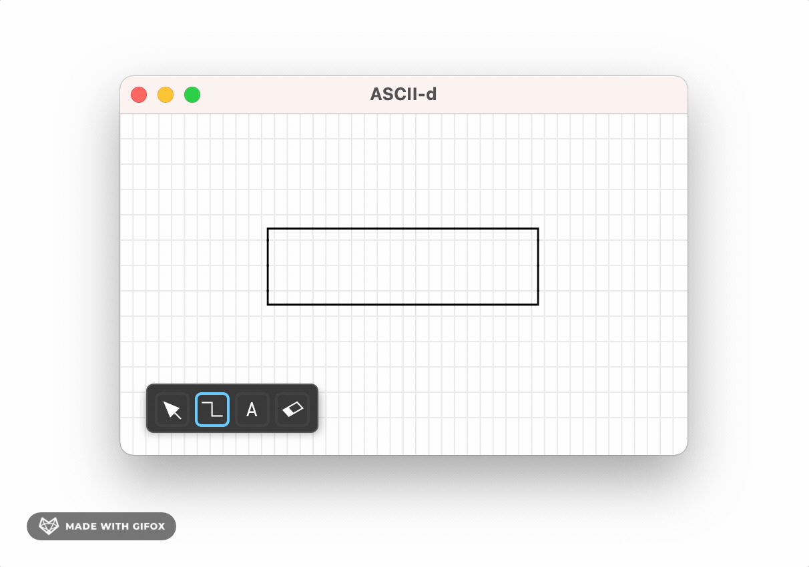

# ASCII-d

ASCII-d is a cross-platform ASCII diagram drawing application, with focus on minimal UI.



Still heavily WIP.

# How to install

To install from source, you can do the following steps.

0. Make sure you have the latest Rust compiler (stable version), and install the `cargo bundle` tool:

```sh
$ cargo install cargo-bundle
```

1. Clone the ASCII-d source code

```sh
$ git clone https://github.com/huytd/ascii-d && cd ascii-d
```

2. Run the bundle command

```sh
$ cargo bundle --release
```

After this step, you'll have the `ASCII-d.app` file inside **target/release/bundle/osx** folder (if you're on macOS).
Just copy this file to your **/Applications** folder and you're done!

# Development progress

See [DEVLOG.md](DEVLOG.md) for the development progress. Or [ARCHITECT.md](ARCHITECT.md) for architecture and technical details.

# Want to support this project?

It would be much appreciated if you want to make a small donation to support my work!

[](https://ko-fi.com/B0B6NHSJ)
